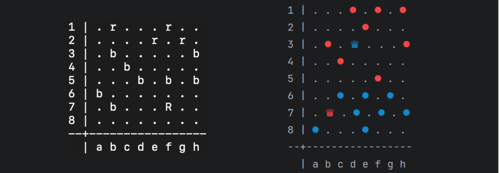

## C++ checkers game

Game Options:
- Player vs Player
- Player vs AI
- PvP Over the network (tested with EC2 instances)
  
The game tracks and displays user statistics. The AI uses the Minimax algorithm with Alpha-Beta pruning to determine moves. Networking is implemented using the sys/socket API for communication between clients and the server.

To enable color in the terminal (available only on Windows), uncomment the second and 30th lines in Main.cpp.

UI:
---

  

UML Diagram:
---

  

